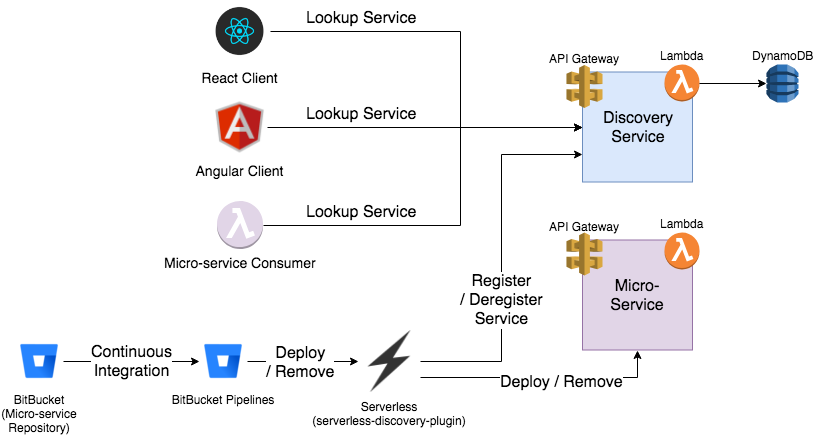

# serverless-discovery
*The last serverless micro-service you'll ever wonder how to find*

This is the home page for the Discovery Framework for a serverless architecture. The Serverless Discovery SDK interacts with a discovery microservice to discover endpoints for micro-services written for a serverless architecture. This is similar to clustered services such as [Consul](https://www.consul.io/intro/index.html) or [ZooKeeper](https://zookeeper.apache.org/), but without the concept of instances or nodes that must be monitored for online state. This library is designed to support use both on the server side (for service-to-service lookups) and on the browser/client side.

Read more about the initial design [here](./design.md)

## Supported micro-service implementations
* [AWS - serverless-discovery-service-aws](https://github.com/adastradev/serverless-discovery-service-aws)

## Supported serverless-discovery-sdk libraries
The Serverless Discovery SDK is designed to be language agnostic and currently has support for the following languages.
Please contact us with suggestions for things you would like to see added to this list, or contribute a library for a new language directly.
* [Typescript/Javascript](https://github.com/adastradev/serverless-discovery-sdk-js)
* [Python](https://github.com/adastradev/serverless-discovery-sdk-python)

## Supporting Tools
* [serverless-discovery-plugin](https://github.com/aregier/serverless-discovery-plugin) - Supports automatic registration as part of a Continuous Deployment / Integration (CD) pipeline via `serverless deploy` for AWS provider