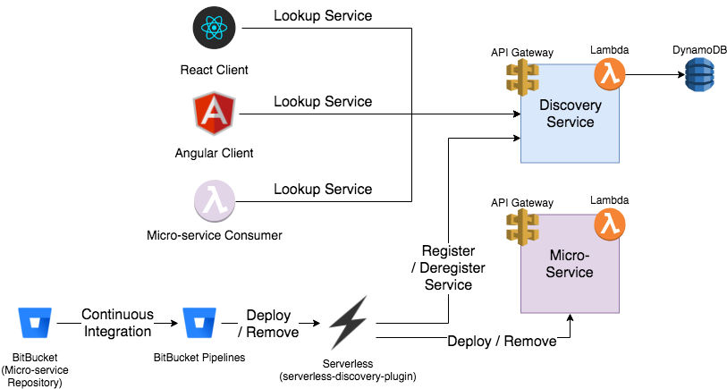

# Serverless Service Discovery

## Requirements and technical design guide
Andrew Regier, Ad Astra
### Requirements
* Provide the ability to perform service discovery in a micro-services architecture that is based on serverless technologies
    * Note: Several solutions for service-discovery with micro-services require running a cluster of always-on servers (e.g. Zookeeper, Consul) 
* Must support both client-side discovery and server-side discovery use cases 
    * Consider augmenting the Amplify API with a library that can do dynamic service discovery rather than static configuration 
* Must support discovery based on service name as well as stage (e.g. "user-management-service" / "Production" vs "user-management-service" / "Staging") 
* Must support automatic registration and de-registration 
    * Note that containerized architectures instrument instance startup code, so a different approach is required for serverless technology 
* Out of scope: 
    * Service health monitoring – Many service discovery frameworks also monitor service health. In some cases, this entails monitoring instances of services. As serverless UI endpoints are already load-balanced abstractions above functions as a service (FaaS), this should be left out of scope for an initial design. 

### Technical Requirements
* The service discovery framework must use serverless technology 
* Must provide a pattern to allow caching lookups across Lambda invocations for performance reasons

## Architecture Design

## Additional Resources

Reference articles regarding the service discovery problem:
* https://aws.amazon.com/blogs/developer/serverless-service-discovery-part-1-get-started/ 
    * This is a similar, unfinished concept for a serverless discovery service without any implementation 
* https://www.nginx.com/blog/service-discovery-in-a-microservices-architecture/ 
* https://www.consul.io/intro/index.html 
* https://serverless.com/framework/docs/providers/aws/guide/plugins/ 
* http://blog.arungupta.me/zookeeper-microservice-registration-discovery/ 
* https://read.acloud.guru/service-discovery-as-a-service-the-missing-serverless-lynchpin-541d001466f4  

## Further work
* Ability to cache results across lambda executions
    * Static json cache w/ waitForEmptyEventLoop=false?
* S3 implementation of the "service" so that an S3 bucket can be used to retrieve all registration records at once. This might be valuable if there are many service-to-service dependencies to reduce latency
